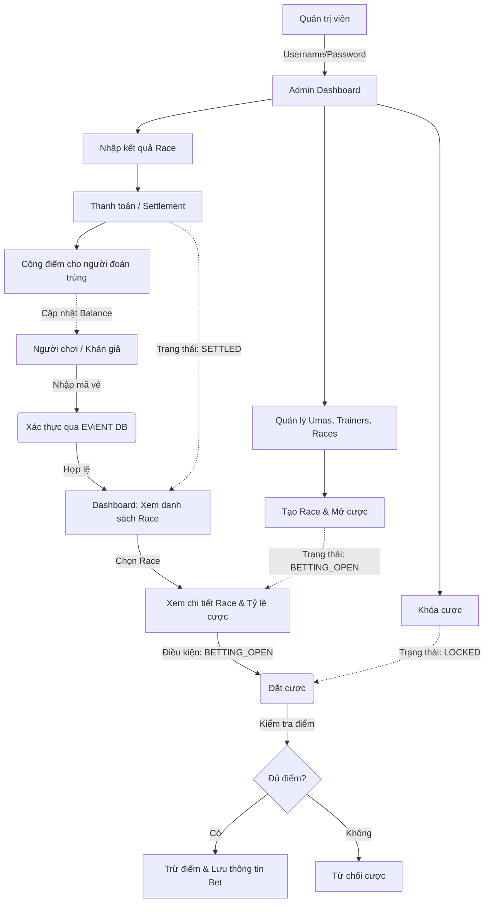

# 🏇 Umamusume Prediction & Betting Platform

Hệ thống nền tảng dự đoán kết quả và cá cược (Betting Platform) dành cho các sự kiện liên quan đến Umamusume. Hệ thống này được tích hợp với hệ thống bán vé **EViENT**, cho phép người dùng đăng nhập bằng mã vé đã mua và sử dụng điểm thưởng để dự đoán kết quả đua.

## 🏗 Cấu trúc hệ thống (System Architecture)

Dự án được chia thành hai phần chính (Backend và Frontend), hoạt động dưới dạng Client-Server và giao tiếp qua REST API & Socket.IO.

- **Frontend (`/frontend`)**: Được xây dựng bằng **Next.js 15**, **TailwindCSS v4**, **Zustand** (quản lý state), và **Framer Motion** (hiệu ứng UI mô phỏng app 1xBet / platform betting). Chạy trên cổng `8000`.
- **Backend (`/backend`)**: Được xây dựng bằng **Express.js (Node.js)**, **TypeScript**, **Mongoose**, và **Socket.IO**. Chạy trên cổng `3005`.
- **Database**: Sử dụng MongoDB (Atlas) với kiến trúc Dual-connection:
  - `betting_db`: Lưu trữ dữ liệu về Race, Uma, Trainer, Người dùng (điểm số), và Lịch sử cược.
  - `evient_orders`: Kết nối cross-database sang hệ thống EViENT để xác thực tính hợp lệ của mã vé khi người dùng đăng nhập.

## 🔄 Luồng hoạt động (Activity Diagram)



## ⚙️ Hướng dẫn cài đặt và chạy dự án (Setup & Run)

### 1. Yêu cầu hệ thống (Prerequisites)

- **Node.js** (Khuyến nghị bản v18.x hoặc v20.x trở lên)
- **npm** (được cài sẵn cùng Node.js)
- Môi trường mạng của bạn đã được trỏ địa chỉ IP (Whitelist IP) trên **MongoDB Atlas** để hệ thống có thể kết nối vào DB.

### 2. Cấu hình biến môi trường (`.env`)

Trong thư mục gốc của project (`betting-platform`), hãy tạo một bản sao của file `.env.example` và đổi tên thành `.env`:

```bash
cp .env.example .env
```

Sau đó, mở file `.env` và điền các thông số thực tế của bạn (đặc biệt là chuỗi kết nối `MONGODB_URI` và `JWT_SECRET`).

### 3. Cài đặt Dependencies

Vì dự án được chia thành 2 thư mục `frontend` và `backend`, bạn cần cài đặt thư viện ở cả hai nơi.

Mở terminal, chạy lệnh cho **backend**:

```bash
cd backend
npm install
```

Mở một tab terminal khác, chạy lệnh cho **frontend**:

```bash
cd frontend
npm install
```

### 4. Khởi chạy hệ thống (Development)

**Chạy Backend Server:**

```bash
cd backend
npm run dev
```

Backend sẽ khởi chạy tại: `http://localhost:3005` (API Server)

**Chạy Frontend Server:**

```bash
cd frontend
npm run dev
```

Frontend sẽ khởi chạy tại: `http://localhost:8000` (Web UI)

_(Lưu ý: Bạn phải chạy song song cả 2 terminal để hệ thống hoạt động)._

## 👮 Thông tin sử dụng & Phân quyền

### 1. Người chơi (User/Player)

- Truy cập vào trang chủ (`http://localhost:8000`), nhấn Đăng nhập bằng **Mã vé (Ticket Code)**.
- Hệ thống tự động xác minh mã vé với Database của EViENT và phân loại User Tier (Normal / VIP / Deluxe).
- Số điểm gốc ban đầu được cấp dựa trên hạng vé.

### 2. Quản trị viên (Admin)

- Truy cập vào: `http://localhost:8000/login` và click "Admin Login".
- Thông tin đăng nhập mặc định (theo `.env`):
  - **Username**: `admin`
  - **Password**: `admin123`
- Tính năng: Thêm/Sửa/Xóa Umas, quản lý Trainer, thao tác với Race (Mở cược, Khóa, Nhập kết quả).
- Bạn có thể **Upload ảnh giới thiệu cho Uma** trong Admin Panel để hiển thị popup thông tin trên màn hình đặt cược.

### 3. Cơ chế trả thưởng (Settlement System)

- Khi một Race có trạng thái `FINISHED` (Đã kết thúc), Admin sẽ vào màn hình **Settlement** để chọn các Uma đạt Top 1, Top 2, Top 3 và ấn nút **Thanh toán**.
- Backend sẽ kiểm tra tất cả các bet thuộc Race đó. Người chơi chọn đúng Hạng mục sẽ được cộng điểm bằng **(Số điểm cược) x (Tỉ lệ Odd)**.
- Giao dịch cộng/trừ điểm được bọc trong `mongoose.startSession()` để đảm bảo an toàn tuyệt đối, tránh lỗi dữ liệu khi mạng gặp sự cố.
